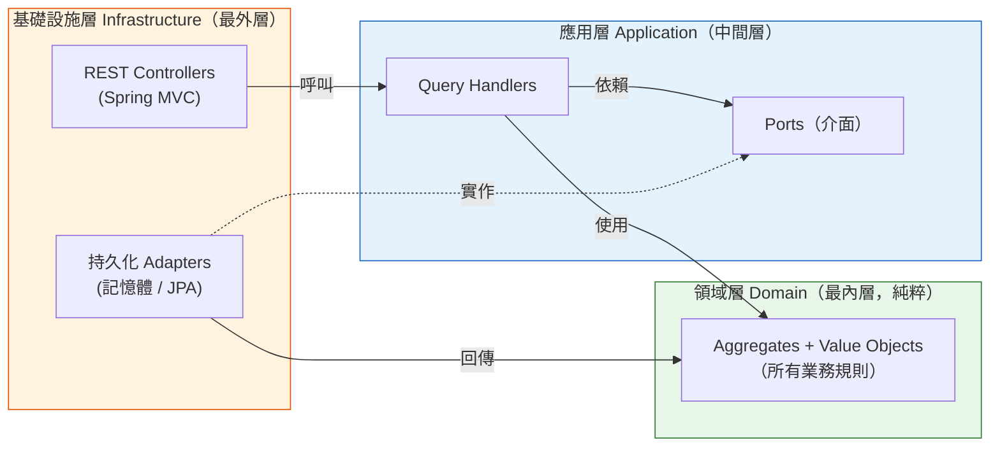
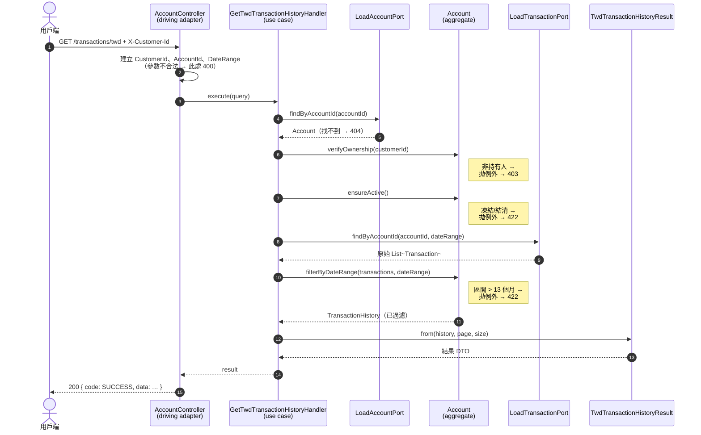
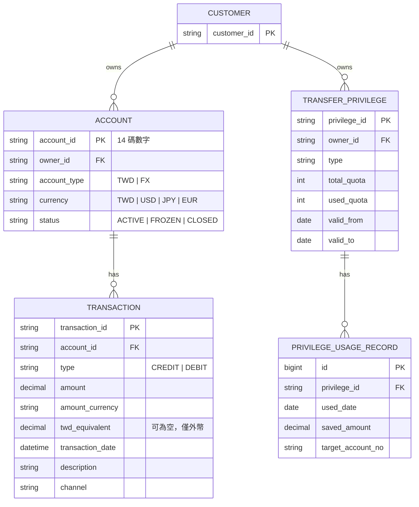
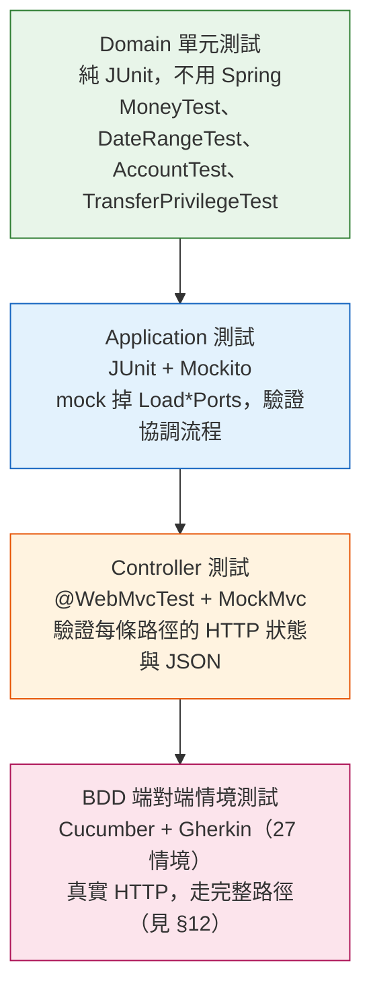
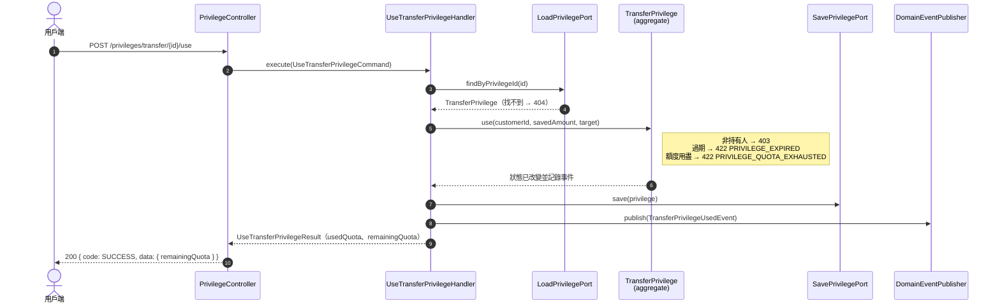

# 銀行帳戶查詢服務 Banking Account Query Service

一個小而**可實際執行**的銀行「帳戶查詢」API，用來把通常只出現在艱澀架構書籍裡的四個概念講清楚：

- **DDD（領域驅動設計）** — 把業務規則放進模型裡，而不是散落在各處程式碼。
- **Hexagonal Architecture（六角形架構／Ports & Adapters）** — 讓核心邏輯獨立於 Web、資料庫與框架之外。
- **CQRS（讀取側 + 一個寫入命令）** — 把「讀取」與「改變狀態」視為兩條獨立、定義明確的路徑（見 [§13](#13-寫入側使用一次轉帳優惠cqrs-命令側)）。
- **TDD** — 每一條規則都有快速、好讀的測試覆蓋。

它實作了 [`banking-api-tutorial-v2.md`](banking-api-tutorial-v2.md) 裡的真實功能：查詢台幣／外幣交易紀錄與轉帳優惠，
而且**只允許已登入的客戶查詢自己的資料**。

> 對這些名詞陌生？先跳到最下面的[名詞解釋](#名詞解釋)，再回來看。你不需要事先全部弄懂——下面的圖會自己說話。

---

## 目錄

1. [快速開始](#1-快速開始)
2. [一條解釋一切的規則：依賴方向規則](#2-一條解釋一切的規則依賴方向規則)
3. [三個層次](#3-三個層次)
4. [架構總覽（圖）](#4-架構總覽圖)
5. [類別圖 — 領域模型](#5-類別圖--領域模型)
6. [循序圖 — 一次請求發生了什麼](#6-循序圖--一次請求發生了什麼)
7. [ER 圖 — 資料如何關聯](#7-er-圖--資料如何關聯)
8. [設計決策說明](#8-設計決策說明)
9. [API](#9-api)
10. [錯誤如何轉換成 HTTP 狀態碼](#10-錯誤如何轉換成-http-狀態碼)
11. [測試策略](#11-測試策略)
12. [BDD 情境測試（Cucumber + Gherkin）](#12-bdd-情境測試cucumber--gherkin)
13. [寫入側：使用一次轉帳優惠（CQRS 命令側）](#13-寫入側使用一次轉帳優惠cqrs-命令側)
14. [與 Tutorial 的差異](#14-與-tutorial-的差異)
15. [名詞解釋](#名詞解釋)

---

## 1. 快速開始

**先決條件：** 一套 JDK（Java 23 以上——本專案設定為 Java 25）。你**不需要**安裝 Gradle、Docker、PostgreSQL 或 Redis
——專案內含 Gradle wrapper，資料皆在記憶體中。

```bash
# 在 repo 根目錄執行
./gradlew test       # 執行全部 72 個測試（45 單元/切片 + 27 BDD 情境，應全綠）
./gradlew bootRun    # 在 http://localhost:8080 啟動 API
```

接著開另一個終端機試打一個請求。身分認證以 `X-Customer-Id` Header 模擬（原因見[§8](#8-設計決策說明)）：

```bash
# 客戶 C001 查詢自己的台幣帳戶 — 成功
curl -H "X-Customer-Id: C001" \
  "http://localhost:8080/api/v1/accounts/00123456789012/transactions/twd?startDate=2025-01-01&endDate=2025-01-31"

# C001 嘗試查詢別人的帳戶 — 被領域模型擋下（HTTP 403）
curl -H "X-Customer-Id: C001" \
  "http://localhost:8080/api/v1/accounts/00999999999999/transactions/twd?startDate=2025-01-01&endDate=2025-01-31"
```

內建示範資料：客戶 **C001** 擁有台幣帳戶 `00123456789012` 與美元帳戶 `00123456789013`，以及優惠 `P001`（有效）與
`P002`（已過期）。帳戶 `00999999999999` 與優惠 `P999` 屬於另一位客戶。

---

## 2. 一條解釋一切的規則：依賴方向規則

幾乎每一個設計選擇都源自這條規則：

> **原始碼的依賴只能指向內層。** 內圈對外圈一無所知。



- **Domain** 不依賴任何東西——沒有 Spring、沒有 JPA、沒有任何 annotation。它是純 Java。這就是「純粹」的意思。
- **Application** 只依賴 Domain，以及它自己定義的介面（也就是 **Port**）。
- **Infrastructure** 依賴所有層——它是把應用程式接到真實世界的黏著劑。

讓新手意外的那支箭頭：資料庫 Adapter（`DB`）往*上*指向 Application 的 `PORTS`（虛線「實作」箭頭）。Application 透過宣告一個介面
說「我需要一個能載入帳戶的東西」；Infrastructure 提供實作。這就是**依賴反轉（Dependency Inversion）**，也正是為什麼核心永遠
不必知道資料是來自 PostgreSQL、Redis 還是一個 `HashMap`。

---

## 3. 三個層次

對應到 `src/main/java/com/bank/accountquery/` 底下的資料夾：

| 層次 | 資料夾 | 職責 | 可依賴 |
|------|--------|------|--------|
| **Domain** | `domain/` | 業務規則與概念（Account、Money…） | 無（純 Java） |
| **Application** | `application/` | 協調一個 Use Case；定義 Ports | 只有 Domain |
| **Infrastructure** | `infrastructure/` | HTTP、持久化、框架接線 | Application + Domain + Spring |

```
domain/
├── model/
│   ├── shared/      Money、Currency、DateRange、CustomerId
│   ├── account/     Account（aggregate）、Transaction、TransactionHistory…
│   └── privilege/   TransferPrivilege（aggregate）、PrivilegeUsageRecord…
├── event/          DomainEvent、TransferPrivilegeUsedEvent（寫入側，見 §13）
└── exception/       AccountNotOwnedByCustomerException、QueryRangeExceededException…

application/
├── port/
│   ├── in/          Use Case 介面（這個應用程式能做什麼，含 UseTransferPrivilegeUseCase）
│   └── out/         Load*Port / SavePrivilegePort / DomainEventPublisher（這個應用程式需要什麼）
├── query/          讀取側：Query 物件 + Handlers + 結果 DTO（account / privilege / common）
└── command/        寫入側：privilege/（Command + Handler + 結果，見 §13）

infrastructure/
├── adapter/
│   ├── in/rest/     Controllers、GlobalExceptionHandler、ApiResponse、CurrentCustomer
│   └── out/
│       ├── persistence/inmemory/   實作 Load*Port / SavePrivilegePort 的 Adapters
│       └── event/                  LoggingDomainEventPublisher（實作 DomainEventPublisher）
└── config/          WebConfig
```

---

## 4. 架構總覽（圖）

「六角形」：應用核心在中央，左邊是**驅動端（driving）** Adapter（呼叫我們的東西），右邊是**被驅動端（driven）**
Adapter（我們呼叫的東西）。


把 `InMemory*Adapter` 換成 `*JpaAdapter`，**核心完全不需要改動**——這就是「對 Port 寫程式」帶來的回報。

---

## 5. 類別圖 — 領域模型

兩個 **aggregate**（`Account`、`TransferPrivilege`）是整個系統的核心。aggregate 是一群被當作單一單位看待的物件，由單一的
**root** 守護所有規則。請注意規則是*以模型上的方法*存在（`verifyOwnership`、`ensureActive`、`filterByDateRange`、
`isValid`），而不是放在某個「service」類別裡。


**為什麼 `Money`、`DateRange`、`CustomerId` 要自成型別**（而不是直接用 `BigDecimal`、兩個 `LocalDate`、一個 `String`）：
因為它們攜帶規則。`Money` 拒絕負數金額，也不會把兩種不同幣別相加。`DateRange` 拒絕起日晚於迄日，並能回答
`exceedsMonths(13)`。這是治療*基本型別偏執（Primitive Obsession）*的解藥——bug 在建構當下、處處、免費地被攔下來。

---

## 6. 循序圖 — 一次請求發生了什麼

`GET /api/v1/accounts/{id}/transactions/twd`。注意各個職責落在哪裡：**Controller** 只做 HTTP 轉換，**Handler** 只做協調，
而每一個業務決策都由 **Account** 做出。



被拋出的例外不會讓 Controller 充滿 `if/else`。它們往上冒泡到單一的 `GlobalExceptionHandler`，由它把每一種例外轉換成正確的
HTTP 狀態碼——見[§10](#10-錯誤如何轉換成-http-狀態碼)。

---

## 7. ER 圖 — 資料如何關聯

本服務以查詢為主（另有一個寫入命令會更新 `TRANSFER_PRIVILEGE` 與 `PRIVILEGE_USAGE_RECORD`），內建記憶體資料，
但其領域模型能乾淨地對應到 Tutorial 針對 PostgreSQL 所規劃的關聯式 schema。概念上：



每個方框都與一個領域型別一對一對應（`ACCOUNT` ↔ `Account`、`TRANSACTION` ↔ `Transaction` 等）。從 `ACCOUNT` 與
`TRANSFER_PRIVILEGE` 出發的那兩條「`||--o{`」關係，就是 **aggregate 邊界**：你永遠是*透過* `Account` 來載入/儲存
`TRANSACTION`，而不會單獨操作它（見 Tutorial 的 ADR-001）。

---

## 8. 設計決策說明

**業務規則屬於模型。** 所有權檢查、「這個帳戶是否啟用？」、「區間是否 ≤ 13 個月？」、「這個優惠是否仍有效？」都是
`Account` / `TransferPrivilege` 上的方法。Handler 刻意保持無聊——它只負責取得、委派、轉換。如果你在 Handler 裡看到
`if (account.getStatus() == FROZEN)`，那就是一個壞味道：規則從模型裡漏出去了。

**Repository 介面放在 Application 層，並以意圖命名。** 它們叫做 `LoadAccountPort`、`LoadTransactionPort`——是*描述應用程式
需要什麼的動詞*，而不是 `AccountRepository`（那會暗示資料庫）。Application 宣告需求；Infrastructure 滿足它。這讓 Domain
完全不沾持久化的概念（Domain 甚至不定義這些介面）。

**為了效能，讀取被拆開（CQRS 讀取側）。** 一個繁忙的帳戶可能有上萬筆交易。只為了讀帳戶狀態就把它們全部載入是浪費，因此
`LoadAccountPort` 回傳*不含*交易的帳戶，再由 `LoadTransactionPort` 單獨抓取有日期界限的片段。接著由 `Account` 套用最終的業務
過濾。這就是 Tutorial ADR-002 的「方案 A」——在把規則留在領域層的同時，仍保持快速。

**處處不可變（Immutability）。** Value Object 與結果 DTO 都是 Java `record`；`TransactionHistory` 對它的清單做防禦性複製。
不可變物件在建立之後無法被破壞，這消除了一整類 bug，也讓程式碼在本應用啟用的虛擬執行緒併發下保持安全。

**錯誤翻譯只有一個地方。** `GlobalExceptionHandler`（一個 Spring `@RestControllerAdvice`）是*唯一*知道業務錯誤要對應到哪個
HTTP 狀態碼的地方。Domain 例外保持與框架無關；對應關係集中在一張好讀的方法表裡。

**本教學切片的認證是模擬的。** 這裡不用完整的 Spring Security + JWT，而是用一個自訂的 `@CurrentCustomer` 參數解析器讀取
`X-Customer-Id` Header 並轉成 `CustomerId`。這保留了重要的邊界——*Controller 不做業務授權*（授權由領域的 `verifyOwnership`
完成）——同時讓專案可執行、好測試。正式版只要把解析器換成讀取 JWT principal 的版本即可，其他都不用動。

---

## 9. API

| 方法 | 路徑 | 說明 |
|------|------|------|
| `GET` | `/api/v1/accounts/{accountId}/transactions/twd` | 台幣交易紀錄 |
| `GET` | `/api/v1/accounts/{accountId}/transactions/fx` | 外幣交易紀錄（呈現台幣等值 + 匯率） |
| `GET` | `/api/v1/customers/me/privileges/transfer` | 列出轉帳優惠 |
| `GET` | `/api/v1/customers/me/privileges/transfer/{privilegeId}/usage` | 某項優惠的使用紀錄 |
| `POST` | `/api/v1/customers/me/privileges/transfer/{privilegeId}/use` | **使用一次優惠（寫入側，見 §13）** |

共用查詢參數：`startDate`、`endDate`（`YYYY-MM-DD`）、`page`（預設 0）、`size`（預設 20，上限 100）。外幣端點另需
`currency`（例如 `USD`）。所有請求都需要 `X-Customer-Id` Header。

每個回應都使用統一的外層格式：

```json
// 成功
{ "code": "SUCCESS", "data": { "...": "..." }, "timestamp": "2026-06-28T21:09:44+08:00" }

// 失敗
{ "code": "ACCOUNT_NOT_OWNED_BY_CUSTOMER", "message": "…", "timestamp": "…" }
```

---

## 10. 錯誤如何轉換成 HTTP 狀態碼

流程永遠是：**領域拋出有業務語意的例外 → `GlobalExceptionHandler` 對應 → 用戶端收到狀態碼 + code。**

| 例外（由誰拋出） | HTTP | `code` |
|------------------|------|--------|
| `InvalidAccountIdFormatException` / 參數錯誤（Controller） | 400 | `INVALID_ACCOUNT_ID` / `BAD_REQUEST` |
| `UnsupportedCurrencyException`（Currency） | 400 | `UNSUPPORTED_CURRENCY` |
| 缺少 `X-Customer-Id`（解析器） | 401 | `UNAUTHORIZED` |
| `AccountNotOwnedByCustomerException`（Account） | 403 | `ACCOUNT_NOT_OWNED_BY_CUSTOMER` |
| `PrivilegeNotOwnedByCustomerException`（TransferPrivilege） | 403 | `PRIVILEGE_NOT_OWNED_BY_CUSTOMER` |
| `AccountNotFoundException`（Handler） | 404 | `ACCOUNT_NOT_FOUND` |
| `PrivilegeNotFoundException`（Handler） | 404 | `PRIVILEGE_NOT_FOUND` |
| `AccountNotActiveException`（Account） | 422 | `ACCOUNT_NOT_ACTIVE` |
| `QueryRangeExceededException`（Account） | 422 | `QUERY_RANGE_EXCEEDED` |
| `AccountCurrencyMismatchException`（Account） | 422 | `ACCOUNT_CURRENCY_MISMATCH` |
| `PrivilegeExpiredException`（TransferPrivilege.use） | 422 | `PRIVILEGE_EXPIRED` |
| `PrivilegeQuotaExhaustedException`（TransferPrivilege.use） | 422 | `PRIVILEGE_QUOTA_EXHAUSTED` |

---

## 11. 測試策略

測試對應各層，並以最快者優先執行——這就是實務上的 TDD 金字塔（共 72 個測試：45 單元/切片 + 27 BDD 情境）：



- **Domain 測試**純粹且即時——它們證明規則（例如「把 USD 加到 TWD 會拋例外」、「14 個月的區間會被拒絕」）。
- **Application 測試**把 Port mock 掉（`@Mock LoadAccountPort`），因此*只*測 Handler 的協調流程——例如「找不到帳戶時，
  我們絕不查詢交易」。
- **Controller 測試**把 Use Case mock 掉，並斷言 HTTP 合約——狀態碼與 JSON 外層格式。
- **BDD 情境測試**啟動真實伺服器，從外部以 HTTP 驗證完整行為（詳見 [§12](#12-bdd-情境測試cucumber--gherkin)）。

只跑某一層，例如：`./gradlew test --tests "*AccountTest"`；只跑 BDD：`./gradlew test --tests "*RunCucumberTest"`。

---

## 12. BDD 情境測試（Cucumber + Gherkin）

**BDD（行為驅動開發）** 用接近自然語言的「情境」描述系統*該有的行為*，讓非工程師也能讀懂、甚至共同撰寫驗收條件。
每個情境寫成 **Given（前提）/ When（動作）/ Then（預期）** 三段式，這些 `.feature` 檔同時是**規格文件**，也是**會自動執行
的測試**——文件與測試永不脫節。

### 工具與運作方式

| 元件 | 角色 |
|------|------|
| **Cucumber 7 + Gherkin** | 以 `.feature` 檔描述情境，並對應到 Java 的 Step Definitions |
| **JUnit Platform Suite** | `RunCucumberTest` 作為進入點，掃描 `features/` 並啟動 Cucumber engine |
| **Spring Boot Test（`RANDOM_PORT`）** | 以隨機埠啟動**真實**應用程式 |
| **JDK `HttpClient`** | 從外部對真實 HTTP 端點發送請求並取得回應 |

與只測單一切片的 `@WebMvcTest` 不同，BDD 情境走**完整路徑**：
`HTTP → AccountController → Handler → Account（領域規則）→ 記憶體 Adapter`，是最貼近真實使用的驗證。

### 檔案位置

```
src/test/
├── java/com/bank/accountquery/bdd/
│   ├── RunCucumberTest.java            # @Suite 進入點
│   ├── CucumberSpringConfiguration.java # @CucumberContextConfiguration + @SpringBootTest(RANDOM_PORT)
│   ├── Hooks.java                       # 每個情境前 reset 資料源（情境彼此獨立）
│   ├── ScenarioContext.java             # 跨步驟共用狀態（認證身分、回應）
│   ├── ApiClient.java                   # 以 HttpClient 打真實端點
│   ├── DataSetupSteps.java              # Given：佈置帳戶／交易／優惠
│   ├── QuerySteps.java                  # When：發送查詢
│   └── AssertionSteps.java              # Then：斷言狀態碼與內容
└── resources/features/
    ├── account/twd_transaction_history.feature
    ├── account/fx_transaction_history.feature
    ├── privilege/transfer_privilege.feature
    ├── privilege/privilege_usage_history.feature
    └── privilege/use_transfer_privilege.feature   # 寫入側（見 §13）
```

### 一個情境長什麼樣子

```gherkin
Scenario: 查詢區間超過 13 個月應被拒絕
  When 客戶查詢帳戶 "00123456789012" 從 "2023-12-01" 到 "2025-02-01" 的台幣交易紀錄
  Then 回應狀態碼為 422
  And 回應代碼為 "QUERY_RANGE_EXCEEDED"
  And 錯誤訊息包含 "13 個月"
```

每個 `.feature` 開頭都有 `Background`（共用前提，例如「客戶已認證」、「客戶有一個啟用的台幣帳戶」），其後是多個情境。
`Hooks` 會在**每個情境開始前清空資料源**，因此情境之間完全獨立、可任意順序執行。

### 涵蓋範圍（27 個情境）

- **台幣交易**：成功查詢、區間過濾、分頁、超過 13 個月（422）、非持有人（403）、帳戶不存在（404）、凍結帳戶（422）、
  帳號格式錯誤（400）、未認證（401）
- **外幣交易**：成功並呈現台幣等值與匯率、不支援幣別（400）、多幣別 Scenario Outline
- **轉帳優惠**：有效優惠、已過期、額度用盡、同時多項
- **優惠使用紀錄**：成功並計算總節省金額、越權查詢（403）、優惠不存在（404）
- **使用優惠（寫入側）**：成功扣減一次、命令影響查詢、額度用盡（422）、過期（422）、越權（403）

### 執行方式

```bash
./gradlew test                              # 含 BDD
./gradlew test --tests "*RunCucumberTest"   # 只跑 BDD
# 報告輸出：build/reports/cucumber/report.html
```

> **小提醒**：本專案的 `.feature` 使用**英文 Gherkin 關鍵字**（`Feature`/`Scenario`/`Given`/`When`/`Then`）搭配**中文步驟
> 文字**。原因是 Cucumber 對 `zh-TW` 方言會以 `Locale.Builder.setLanguage("zh-TW")` 建立語系而拋出例外；步驟比對僅依
> 文字內容，與關鍵字語言無關，故情境敘述仍維持中文。

---

## 13. 寫入側：使用一次轉帳優惠（CQRS 命令側）

前面 §1–§11 都是**讀取側**（Query）。為了示範完整的 DDD 戰術設計，本專案加入一個**寫入側**（Command）使用案例：
**使用一次轉帳優惠**。它把讀取側沒機會展現的元件補齊——Command、CommandHandler、改變狀態並守護不變式的 Aggregate 行為、
以 Aggregate Root 為單位的 Save Port，以及領域事件。

### 它示範了什麼

| 戰術元件 | 在本案例中的體現 |
|----------|------------------|
| **Command** | `UseTransferPrivilegeCommand`（不可變，表達「使用一次」的意圖） |
| **CommandHandler** | `UseTransferPrivilegeHandler`：載入 → 委派 Domain → 儲存 → 發布事件（不含業務判斷） |
| **Aggregate 行為與不變式** | `TransferPrivilege.use(...)`：先驗證所有權、有效期、剩餘額度，再 `usedQuota+1` 並新增使用紀錄 |
| **以 Aggregate Root 為單位儲存** | `SavePrivilegePort.save(TransferPrivilege)`（見 ADR-001，**絕不**提供 `save(PrivilegeUsageRecord)`） |
| **Domain Event** | `TransferPrivilegeUsedEvent` 由 Aggregate 記錄、Handler 透過 `DomainEventPublisher` 發布 |

### 為什麼這正是 DDD 的重點

> **一致性邊界（Consistency Boundary）。** 「過期或額度用盡的優惠不可被使用」這條不變式被封裝在 `TransferPrivilege.use()`
> 內，外界無法繞過 Aggregate Root 直接改 `usedQuota` 或硬塞一筆使用紀錄。這正是 ADR-001 強調「寫入必須以 Aggregate Root
> 為單位」的原因——若允許 `save(PrivilegeUsageRecord)`，這條規則就無人看守了。

Handler 一樣只做協調，沒有任何 `if` 業務判斷：

```java
TransferPrivilege p = loadPrivilegePort.findByPrivilegeId(cmd.privilegeId())
    .orElseThrow(() -> new PrivilegeNotFoundException(cmd.privilegeId()));
p.use(cmd.customerId(), cmd.savedAmount(), cmd.targetAccountNo()); // ← 不變式都在這裡守護
savePrivilegePort.save(p);                                          // ← 整個 Aggregate Root
p.pullDomainEvents().forEach(eventPublisher::publish);              // ← 發布領域事件
```

### 請求流程



### 試一下（命令影響查詢）

```bash
# 使用一次優惠 P001（節省 15 元，轉帳至 8123…）
curl -X POST -H "X-Customer-Id: C001" -H "Content-Type: application/json" \
  -d '{"targetAccountNo":"81234567890123","savedAmount":15}' \
  "http://localhost:8080/api/v1/customers/me/privileges/transfer/P001/use"

# 再查使用紀錄，會多出剛剛那一筆 → 寫入即時反映於讀取
curl -H "X-Customer-Id: C001" \
  "http://localhost:8080/api/v1/customers/me/privileges/transfer/P001/usage?startDate=2020-01-01&endDate=2030-12-31"
```

> 示範用的記憶體啟動資料中，`P001` 為有效優惠（有效期 2025–2030、剩餘 7 次），故上面的 `use` 會成功並使剩餘次數變為 6；
> 重啟應用程式即可重置回 7。`P002` 則為已過期優惠，對其呼叫 `use` 會得到 `422 PRIVILEGE_EXPIRED`。

---

## 14. 與 Tutorial 的差異

為了讓這個切片在任何只裝了 JDK 的機器上都能執行，本實作用較輕量、但**介面相同**的等價物取代了笨重的基礎設施：

| Tutorial | 本實作 | 為何安全 |
|----------|--------|----------|
| Java 23 | Java 25 | 超集；使用的語言特性完全相同 |
| PostgreSQL + JPA + Redis + Testcontainers | 記憶體 Adapter | 它們實作相同的 `Load*Port` / `SavePrivilegePort`；換成 `*JpaAdapter` 不需改核心 |
| Spring Security + JWT | `X-Customer-Id` Header + 參數解析器 | 維持「Controller 不做授權」的邊界；可輕易替換 |
| Cucumber BDD（Testcontainers／WireMock 版） | **Cucumber + 記憶體資料源**（見 §12） | 已實作 27 個端對端情境；以記憶體取代真實容器 |
| 僅讀取側 | 讀取側 + **一個寫入命令**（見 §13） | 補齊 Command／Event，成為更完整的 DDD 示範 |
| WireMock、Micrometer、OpenAPI | 暫未納入 | 屬 Sprint-5 範圍，不在此切片內 |

完整的設計理由（包含三個被否決的讀取側方案與各項 ADR）收錄於 [`banking-api-tutorial-v2.md`](banking-api-tutorial-v2.md)。

---

## 名詞解釋

- **Domain（領域）** — 用程式碼建模的業務世界（帳戶、金錢、優惠），不含任何技術考量。
- **Aggregate / Aggregate Root（聚合／聚合根）** — 一群相關物件被當作單一單位；其*root*（例如 `Account`）是唯一入口，
  並強制執行整群的規則。這裡的 `Transaction` 只能透過它的 `Account` 取得。
- **Entity（實體）** — 具有身分、會隨時間延續的物件（例如以 `TransactionId` 識別的 `Transaction`）。
- **Value Object（值物件）** — 純粹由其值定義、不可變、沒有身分的物件（例如 `Money`、`DateRange`）。兩個
  `Money(100, TWD)` 可互換。
- **Port（埠）** — 由應用核心擁有的介面。*Input port* 是應用程式對外提供的 Use Case；*output port*（`Load*Port`）是應用程式
  需要外界提供的能力。
- **Adapter（轉接器）** — 位於 Infrastructure、實作某個 Port 的具體類別。*Driving*（驅動端）adapter 呼叫應用程式（REST
  controller）；*driven*（被驅動端）adapter 被應用程式呼叫（持久化）。
- **Command（命令）** — 表達「改變狀態的意圖」的不可變物件（如 `UseTransferPrivilegeCommand`），由 CommandHandler 處理。
- **Domain Event（領域事件）** — 「領域中已發生的事實」（過去式命名，如 `TransferPrivilegeUsedEvent`），由 Aggregate 記錄、
  Application 透過 Output Port 發布。
- **CQRS** — Command Query Responsibility Segregation（命令查詢職責分離）：把寫入路徑與讀取路徑分開。本專案以讀取（查詢）側
  為主，並示範一個完整的寫入側命令（使用一次轉帳優惠，見 §13）。
- **Dependency Inversion（依賴反轉）** — 高階程式碼依賴介面而非具體細節；細節反過來依賴介面。正是這點讓資料庫能往「內」
  指向應用程式的 Port。
- **DTO** — Data Transfer Object（資料傳輸物件）：用來跨邊界搬運資料的單純結構（這裡是回傳給用戶端的 JSON `*Result` /
  `*Dto` record）。
