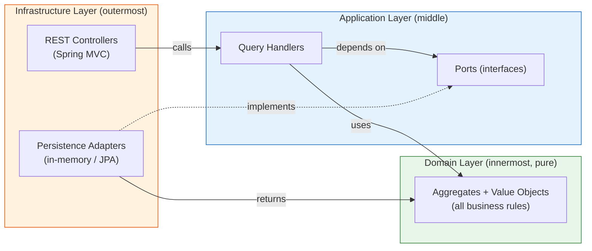
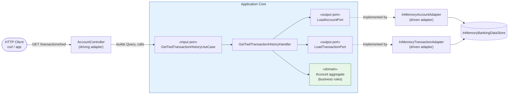
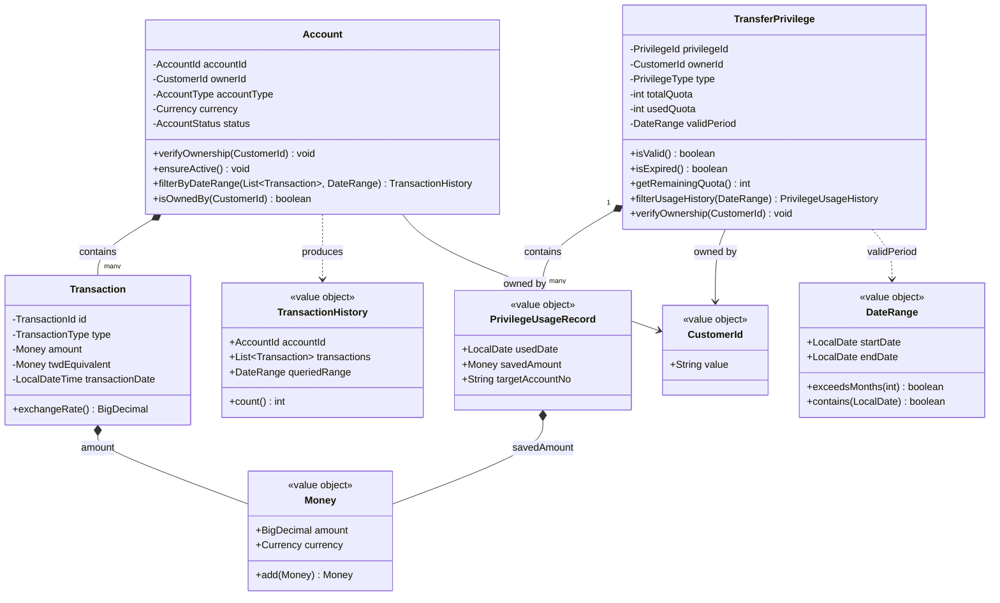
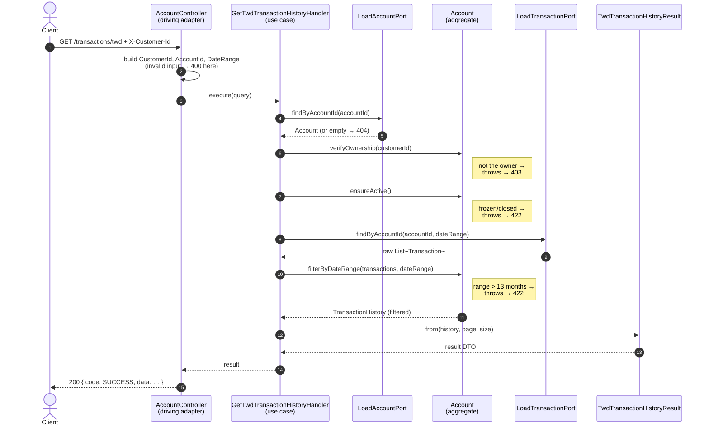
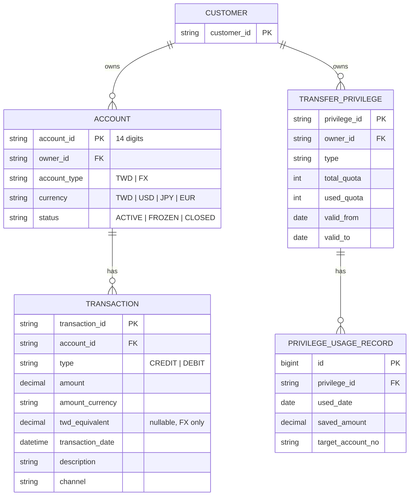
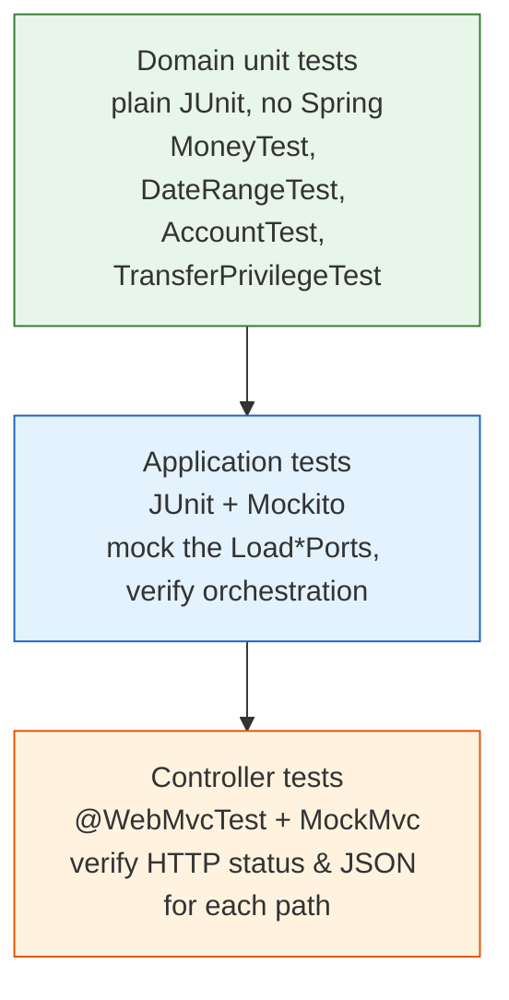

# Banking Account Query Service

A small, **runnable** banking "account query" API built to teach four ideas that usually only appear in dense
architecture books:

- **DDD (Domain-Driven Design)** — put business rules in the model, not scattered across the code.
- **Hexagonal Architecture (Ports & Adapters)** — keep the core logic independent of the web, the database, and frameworks.
- **CQRS (read side)** — treat "reading data" as its own well-defined path.
- **TDD** — every rule is covered by a fast, readable test.

It implements a real feature set from [`../banking-api-tutorial-v2.md`](../banking-api-tutorial-v2.md): querying NTD/foreign-currency
transactions and transfer-fee privileges, **for the logged-in customer only**.

> New to these terms? Jump to the [Glossary](#glossary) at the bottom — then come back. You don't need to know
> them up front; the diagrams below explain themselves.

---

## Table of contents

1. [Quick start](#1-quick-start)
2. [The one rule that explains everything: the Dependency Rule](#2-the-one-rule-that-explains-everything-the-dependency-rule)
3. [The three layers](#3-the-three-layers)
4. [Architecture at a glance (diagram)](#4-architecture-at-a-glance-diagram)
5. [Class diagram — the domain model](#5-class-diagram--the-domain-model)
6. [Sequence diagram — what happens on one request](#6-sequence-diagram--what-happens-on-one-request)
7. [ER diagram — how the data relates](#7-er-diagram--how-the-data-relates)
8. [Design decisions explained](#8-design-decisions-explained)
9. [The API](#9-the-api)
10. [How errors become HTTP status codes](#10-how-errors-become-http-status-codes)
11. [Testing strategy](#11-testing-strategy)
12. [Where this differs from the tutorial](#12-where-this-differs-from-the-tutorial)
13. [Glossary](#glossary)

---

## 1. Quick start

**Prerequisites:** a JDK (Java 23 or newer — the project is configured for Java 25). You do **not** need to install
Gradle, Docker, PostgreSQL, or Redis — the Gradle wrapper is included and the data is in-memory.

```bash
cd banking-account-query-service

./gradlew test       # run all 33 tests (should be green)
./gradlew bootRun    # start the API on http://localhost:8080
```

Then, in another terminal, try a request. Authentication is simulated with an `X-Customer-Id` header
(see [§8](#8-design-decisions-explained) for why):

```bash
# Customer C001 reads their own NTD account — succeeds
curl -H "X-Customer-Id: C001" \
  "http://localhost:8080/api/v1/accounts/00123456789012/transactions/twd?startDate=2025-01-01&endDate=2025-01-31"

# C001 tries to read someone else's account — blocked by the domain model (HTTP 403)
curl -H "X-Customer-Id: C001" \
  "http://localhost:8080/api/v1/accounts/00999999999999/transactions/twd?startDate=2025-01-01&endDate=2025-01-31"
```

Seeded demo data: customer **C001** owns NTD account `00123456789012` and USD account `00123456789013`, plus
privileges `P001` (valid) and `P002` (expired). Account `00999999999999` and privilege `P999` belong to another customer.

---

## 2. The one rule that explains everything: the Dependency Rule

Almost every design choice here follows from a single rule:

> **Source code dependencies only point inward.** The inner circle knows nothing about the outer circle.



- **Domain** depends on *nothing* — no Spring, no JPA, no annotations. It's plain Java. That's what "pure" means.
- **Application** depends only on Domain + interfaces it defines itself (the **Ports**).
- **Infrastructure** depends on everything — it's the glue that wires the app to the real world.

The arrow that surprises beginners: the database adapter (`DB`) points *up* into the Application's `PORTS`
(the dashed "implements" arrow). The Application says *"I need something that can load an account"* by declaring an
interface; Infrastructure provides the implementation. This is **Dependency Inversion**, and it's why the core never
has to know whether data comes from PostgreSQL, Redis, or a `HashMap`.

---

## 3. The three layers

Mapped to folders under `src/main/java/com/bank/accountquery/`:

| Layer | Folder | Responsibility | May depend on |
|-------|--------|----------------|---------------|
| **Domain** | `domain/` | Business rules + concepts (Account, Money, …) | nothing (pure Java) |
| **Application** | `application/` | Orchestrate a use case; define Ports | Domain only |
| **Infrastructure** | `infrastructure/` | HTTP, persistence, framework wiring | Application + Domain + Spring |

```
domain/
├── model/
│   ├── shared/      Money, Currency, DateRange, CustomerId
│   ├── account/     Account (aggregate), Transaction, TransactionHistory, …
│   └── privilege/   TransferPrivilege (aggregate), PrivilegeUsageRecord, …
└── exception/       AccountNotOwnedByCustomerException, QueryRangeExceededException, …

application/
├── port/
│   ├── in/          Use-case interfaces (what the app can do)
│   └── out/         Load*Port interfaces (what the app needs) ← repository interfaces live HERE
└── query/
    ├── account/     Query objects + Handlers + result DTOs
    ├── privilege/   Query objects + Handlers + result DTOs
    └── common/      PageInfo, Pagination

infrastructure/
├── adapter/
│   ├── in/rest/     Controllers, GlobalExceptionHandler, ApiResponse, CurrentCustomer
│   └── out/persistence/inmemory/   Adapters implementing the Load*Ports
└── config/          WebConfig
```

---

## 4. Architecture at a glance (diagram)

The "hexagon": the application core in the middle, with **driving** adapters on the left (things that call us) and
**driven** adapters on the right (things we call).



Swap `InMemory*Adapter` for `*JpaAdapter` and **nothing in the core changes** — that's the payoff of programming to
the ports.

---

## 5. Class diagram — the domain model

The two **aggregates** (`Account`, `TransferPrivilege`) are the heart of the system. An aggregate is a cluster of
objects treated as one unit, with a single **root** that guards all the rules. Notice the rules live *as methods on
the model* (`verifyOwnership`, `ensureActive`, `filterByDateRange`, `isValid`), not in some "service" class.



**Why `Money`, `DateRange`, `CustomerId` are their own types** (rather than `BigDecimal`, two `LocalDate`s, and a
`String`): they carry rules. `Money` refuses negative amounts and won't add two different currencies. `DateRange`
refuses a start after an end and can answer `exceedsMonths(13)`. This is the antidote to *Primitive Obsession* — bugs
get caught at construction time, everywhere, for free.

---

## 6. Sequence diagram — what happens on one request

`GET /api/v1/accounts/{id}/transactions/twd`. Watch where each responsibility lives: the **Controller** only
translates HTTP, the **Handler** only orchestrates, and the **Account** makes every business decision.



The thrown exceptions don't clutter the Controller with `if/else`. They bubble up to a single
`GlobalExceptionHandler` that converts each one to the right HTTP status — see [§10](#10-how-errors-become-http-status-codes).

---

## 7. ER diagram — how the data relates

This service is read-only and ships with in-memory data, but the domain maps cleanly onto the relational schema the
tutorial targets for PostgreSQL. Conceptually:



Each box matches a domain type one-to-one (`ACCOUNT` ↔ `Account`, `TRANSACTION` ↔ `Transaction`, etc.). The two
"`||--o{`" relationships from `ACCOUNT` and `TRANSFER_PRIVILEGE` are the **aggregate boundaries**: you always load and
save a `TRANSACTION` *through* its `Account`, never on its own (see ADR-001 in the tutorial).

---

## 8. Design decisions explained

**Business rules belong to the model.** Ownership checks, "is this account active?", "is the range ≤ 13 months?",
"is this privilege still valid?" are all methods on `Account` / `TransferPrivilege`. The Handler is deliberately
boring — it fetches, delegates, and maps. If you ever see an `if (account.getStatus() == FROZEN)` inside a Handler,
that's a smell: the rule leaked out of the model.

**Repository interfaces live in the Application layer, named after intent.** They're called `LoadAccountPort`,
`LoadTransactionPort` — *verbs describing what the app needs*, not `AccountRepository` (which hints at a database).
The Application declares the need; Infrastructure satisfies it. This keeps the Domain free of persistence concerns
entirely (the Domain doesn't even define these interfaces).

**Reads are split for performance (CQRS read side).** A busy account can have tens of thousands of transactions.
Loading them all just to read account status would be wasteful, so `LoadAccountPort` returns the account *without*
transactions, and `LoadTransactionPort` fetches a date-bounded slice separately. The `Account` then applies the final
business filter. This is "Option A" in the tutorial's ADR-002 — it keeps the rules in the domain while staying fast.

**Immutability everywhere.** Value objects and result DTOs are Java `record`s; `TransactionHistory` makes a defensive
copy of its list. Immutable objects can't be corrupted after creation, which removes a whole category of bugs and
makes the code safe under the virtual-thread concurrency this app enables.

**One place to translate errors.** `GlobalExceptionHandler` (a Spring `@RestControllerAdvice`) is the *only* place
that knows about HTTP status codes for business errors. Domain exceptions stay framework-free; the mapping is in one
readable table of methods.

**Authentication is simulated for this teaching slice.** Instead of full Spring Security + JWT, a custom
`@CurrentCustomer` argument resolver reads an `X-Customer-Id` header and turns it into a `CustomerId`. This preserves
the important boundary — *the controller does not perform business authorization* (the domain does, via
`verifyOwnership`) — while keeping the project runnable and easy to test. A production version swaps the resolver for
one that reads the JWT principal; nothing else changes.

---

## 9. The API

| Method | Path | Description |
|--------|------|-------------|
| `GET` | `/api/v1/accounts/{accountId}/transactions/twd` | NTD transaction history |
| `GET` | `/api/v1/accounts/{accountId}/transactions/fx` | Foreign-currency history (shows TWD equivalent + rate) |
| `GET` | `/api/v1/customers/me/privileges/transfer` | List transfer-fee privileges |
| `GET` | `/api/v1/customers/me/privileges/transfer/{privilegeId}/usage` | A privilege's usage history |

Common query params: `startDate`, `endDate` (`YYYY-MM-DD`), `page` (default 0), `size` (default 20, max 100). The FX
endpoint also requires `currency` (e.g. `USD`). All requests need the `X-Customer-Id` header.

Every response uses one envelope:

```json
// success
{ "code": "SUCCESS", "data": { "...": "..." }, "timestamp": "2026-06-28T21:09:44+08:00" }

// failure
{ "code": "ACCOUNT_NOT_OWNED_BY_CUSTOMER", "message": "…", "timestamp": "…" }
```

---

## 10. How errors become HTTP status codes

The flow is always: **domain throws a meaningful exception → `GlobalExceptionHandler` maps it → client gets a status + code.**

| Exception (thrown by) | HTTP | `code` |
|------------------------|------|--------|
| `InvalidAccountIdFormatException` / bad params (Controller) | 400 | `INVALID_ACCOUNT_ID` / `BAD_REQUEST` |
| `UnsupportedCurrencyException` (Currency) | 400 | `UNSUPPORTED_CURRENCY` |
| missing `X-Customer-Id` (resolver) | 401 | `UNAUTHORIZED` |
| `AccountNotOwnedByCustomerException` (Account) | 403 | `ACCOUNT_NOT_OWNED_BY_CUSTOMER` |
| `PrivilegeNotOwnedByCustomerException` (TransferPrivilege) | 403 | `PRIVILEGE_NOT_OWNED_BY_CUSTOMER` |
| `AccountNotFoundException` (Handler) | 404 | `ACCOUNT_NOT_FOUND` |
| `PrivilegeNotFoundException` (Handler) | 404 | `PRIVILEGE_NOT_FOUND` |
| `AccountNotActiveException` (Account) | 422 | `ACCOUNT_NOT_ACTIVE` |
| `QueryRangeExceededException` (Account) | 422 | `QUERY_RANGE_EXCEEDED` |
| `AccountCurrencyMismatchException` (Account) | 422 | `ACCOUNT_CURRENCY_MISMATCH` |

---

## 11. Testing strategy

Tests mirror the layers and run fastest-first — this is the TDD pyramid in practice (33 tests total):



- **Domain tests** are pure and instant — they prove the rules (e.g. "adding USD to TWD throws", "a 14-month range is rejected").
- **Application tests** mock the ports (`@Mock LoadAccountPort`) so they test *only* the Handler's orchestration —
  e.g. "if the account isn't found, we never query transactions".
- **Controller tests** mock the use case and assert the HTTP contract — status codes and the JSON envelope.

Run a single layer, e.g.: `./gradlew test --tests "*AccountTest"`.

---

## 12. Where this differs from the tutorial

To stay runnable on any machine with just a JDK, this slice substitutes the heavy infrastructure with lightweight
equivalents that keep the **same interfaces**:

| Tutorial | Here | Why it's safe |
|----------|------|---------------|
| Java 23 | Java 25 | Superset; identical language features used |
| PostgreSQL + JPA + Redis + Testcontainers | In-memory adapters | They implement the same `Load*Port`; swap in `*JpaAdapter` with no core changes |
| Spring Security + JWT | `X-Customer-Id` header + argument resolver | Keeps the "controller doesn't authorize" boundary; trivially replaceable |
| Cucumber BDD, WireMock, Micrometer, OpenAPI | covered by `@WebMvcTest` + curl | Sprint-5 scope, out of this slice |

The full design rationale (including the three rejected read-side options and the ADRs) is in
[`../banking-api-tutorial-v2.md`](../banking-api-tutorial-v2.md).

---

## Glossary

- **Domain** — the business world (accounts, money, privileges) modelled in code, free of technical concerns.
- **Aggregate / Aggregate Root** — a cluster of related objects treated as one unit; the *root* (e.g. `Account`) is the
  only entry point and enforces all the cluster's rules. Here, a `Transaction` is reached only via its `Account`.
- **Entity** — an object with an identity that persists over time (e.g. `Transaction`, identified by `TransactionId`).
- **Value Object** — an object defined purely by its values, immutable, with no identity (e.g. `Money`, `DateRange`). Two
  `Money(100, TWD)` are interchangeable.
- **Port** — an interface owned by the application core. *Input ports* are use cases the app offers; *output ports*
  (`Load*Port`) are capabilities the app needs from the outside.
- **Adapter** — a concrete implementation of a port living in Infrastructure. *Driving* adapters call the app (REST
  controller); *driven* adapters are called by the app (persistence).
- **CQRS** — Command Query Responsibility Segregation: separating the write path from the read path. This project
  implements only the read (query) side.
- **Dependency Inversion** — high-level code depends on interfaces, not concrete details; the details depend on the
  interfaces. It's what lets the database point "inward" to the application's ports.
- **DTO** — Data Transfer Object: a plain shape used to carry data across a boundary (here, the JSON `*Result` / `*Dto`
  records returned to clients).
